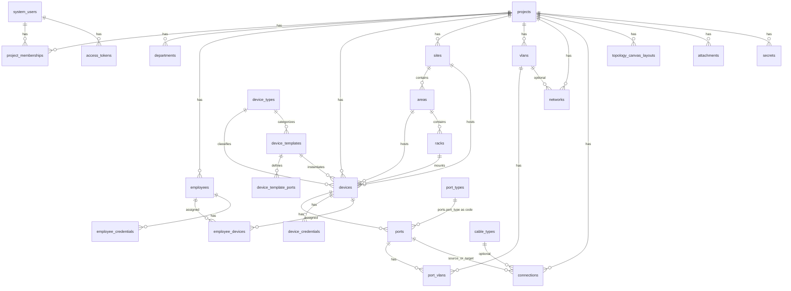
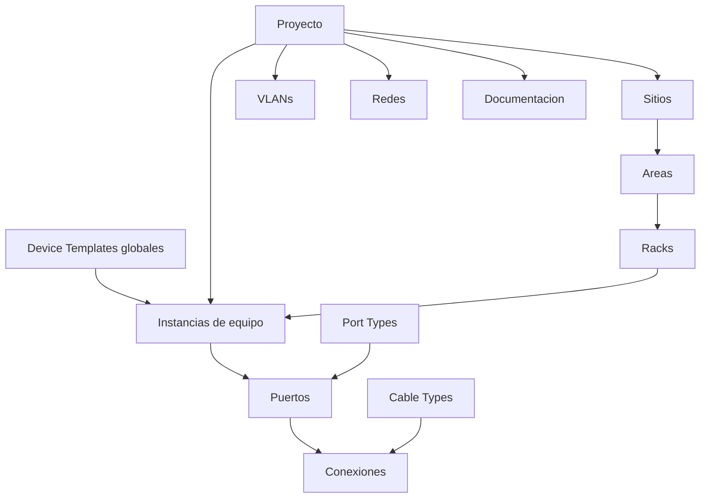

# Modelo de dominio

Estado del esquema y del lenguaje de dominio: **actual** vs **objetivo**.

---

## ER simplificado (actual)

### Entidades presentes

| Entidad | Notas |
|---------|--------|
| `projects` | Scope raíz (UX: "Proyecto") — ADR 0001 opción A |
| `project_memberships` | Rol por proyecto |
| `system_users` | Auth + rol global |
| `departments`, `employees` | RRHH / asignaciones |
| `device_types` | Catálogo nombre/icono — **no** es Device Template |
| `device_templates` | Catálogo global de SKU (marca, modelo, U, imagen, custom…); soft delete — ADR 0004 |
| `device_template_ports` | Definición de puertos del template (clonados a la instancia) |
| `sites` | Inventario físico por proyecto; soft delete |
| `areas` | Bajo un sitio (planta/sala…); soft delete — **no** es `work_areas` del canvas |
| `racks` | Bajo un área; `height_u`; soft delete |
| `devices` | Instancia de template; `site_id`/`area_id`/`rack_id` nullable; `rack_unit_start` + `rack_face`; `location` texto legacy |
| `ports` | Por dispositivo; `port_type` string alineado a `port_types.code` |
| `port_types` | Catálogo: code, name, description, `default_speed`, color, icon, direction |
| `cable_types` | Catálogo global de medios (familia, defaults, color, orden) |
| `attachments` | Docs polimórficos (archivo/link/nota) por objeto + `project_id` |
| `secrets` | Secretos cifrados polimórficos (reveal con mutate) |
| `vlans`, `networks`, `port_vlans` | Capa L2/L3 |
| `connections` | Entidad de primera clase; `cable_type_id` opcional; 1 física activa / puerto |
| `topology_canvas_layouts` | Layout visual + work_areas JSON; posiciones de racks (`rack:{id}`) |
| `device_credentials`, `employee_credentials` | Secretos legacy de device/employee |

**Topología física (canvas):** `GET /topology` expone en cada device `siteId`/`areaId`/`rackId`/`rackUnitStart`/`rackFace`/`rackUnits` y una lista `racks[]`. El canvas proyecta racks como contenedores con elevación por U; los equipos montados son hijos posicionados por U (no se persisten coords relativas U). `work_areas` del canvas ≠ `areas` de inventario. Impresión: filtros de inventario (sitio/área/rack/cara) en cliente → PDF tabla y/o diagrama.

### Ausentes respecto a la visión

| Concepto | Estado |
|----------|--------|
| Object storage cloud (S3/Drive/Blobs) | Diferido — hoy disco local (ADR 0003) |
| Auditoría by-user + soft delete | Piloto en devices/connections/templates/sites/areas/racks/attachments/secrets; resto aún no |

---

## Modelo objetivo (producto)

### Template vs instancia

| En el Template | En la instancia |
|----------------|-----------------|
| Marca, modelo, U, imagen, consumo, peso | Nombre |
| Definición y layout de puertos | Serie, IP, MAC, hostname |
| Vistas frontal/trasera, campos custom | Estado, ubicación, rack, proyecto, notas |

### Conexiones (ya alineadas en espíritu)

Origen/destino por puerto, tipo de cable, longitud, estado, etiqueta, observaciones, fecha, usuario. Regla objetivo: **un puerto = una conexión activa**.

---

## Gaps prioritarios

1. ~~Cerrar ADR Company → Project~~ (hecho: opción A).
2. Fundaciones: Repository/DTO, auditoría, soft delete.
3. Device Templates + instanciación.
4. Sites / Areas / Racks + visor.
5. ~~Enriquecer `port_types` y catálogo de cables + unicidad de conexión~~ (Fase 5).
6. ~~Documentación adjunta polimórfica~~ (Fase 6).
7. ~~Dashboard con métricas reales~~ (Fase 7).

Detalle de fases: [ROADMAP.md](ROADMAP.md).
