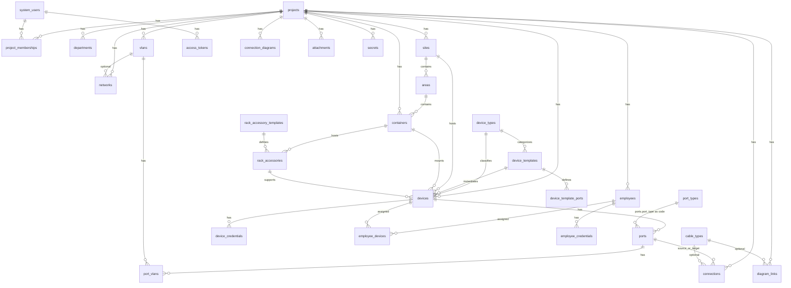
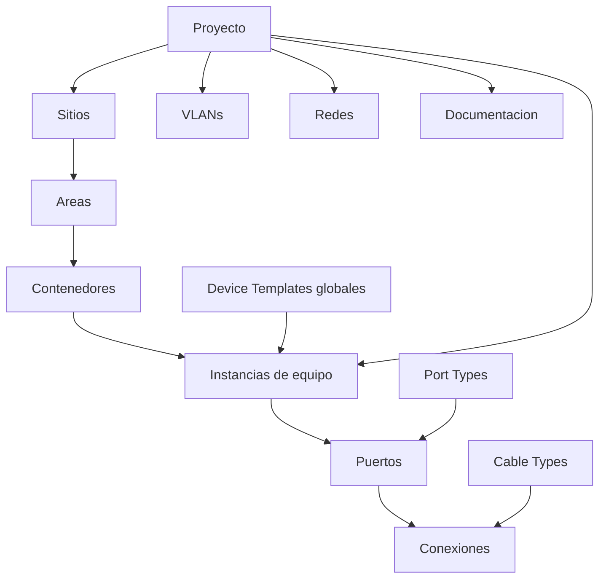

# Modelo de dominio

Estado del esquema y del lenguaje de dominio: **actual** vs **objetivo**.

---

## ER simplificado (actual)

```mermaid
erDiagram
    projects ||--o{ project_memberships : has
    projects ||--o{ departments : has
    projects ||--o{ employees : has
    projects ||--o{ devices : has
    projects ||--o{ sites : has
    projects ||--o{ vlans : has
    projects ||--o{ networks : has
    projects ||--o{ connections : has
    system_users ||--o{ project_memberships : has
    system_users ||--o{ access_tokens : has
    device_types ||--o{ devices : classifies
    device_types ||--o{ device_templates : categorizes
    device_templates ||--o{ device_template_ports : defines
    device_templates ||--o{ devices : instantiates
    sites ||--o{ areas : contains
    sites ||--o{ devices : hosts
    areas ||--o{ containers : contains
    containers ||--o{ devices : mounts
    containers ||--o{ rack_accessories : hosts
    projects ||--o{ connection_diagrams : has
    projects ||--o{ diagram_links : has
    projects ||--o{ containers : has
    rack_accessory_templates ||--o{ rack_accessories : defines
    rack_accessories ||--o{ devices : supports
    devices ||--o{ ports : has
    devices ||--o{ device_credentials : has
    ports ||--o{ port_vlans : has
    vlans ||--o{ port_vlans : has
    vlans ||--o{ networks : optional
    ports ||--o{ connections : source_or_target
    employees ||--o{ employee_devices : assigned
    devices ||--o{ employee_devices : assigned
    employees ||--o{ employee_credentials : has
    port_types ||--o{ ports : "ports.port_type as code"
    cable_types ||--o{ connections : optional
    cable_types ||--o{ diagram_links : optional
    projects ||--o{ attachments : has
    projects ||--o{ secrets : has
```

### Entidades presentes

| Entidad | Notas |
|---------|--------|
| `projects` | Scope raíz (UX: "Proyecto") — ADR 0001 opción A |
| `project_memberships` | Rol por proyecto |
| `system_users` | Auth + rol global |
| `departments`, `employees` | RRHH / asignaciones |
| `device_types` | Catálogo nombre/icono — **no** es Device Template |
| `device_templates` | Catálogo global de SKU (marca, modelo, U, `is_full_depth`, imagen, custom…); soft delete — ADR 0004 + ADR 0007 |
| `device_template_ports` | Definición de puertos del template (`is_passthrough`, `chassis_face`); clonados a la instancia |
| `sites` | Inventario físico por proyecto; soft delete |
| `areas` | Bajo un sitio (planta/sala…); soft delete — **no** es `work_areas` del canvas |
| `containers` | Contenedor unificado bajo área; `kind` = `default` \| `rack` \| `board`; rack: `height_u`; board: `board_kind` + `grid_rows`×`grid_cols`; default: equipos sueltos; soft delete — ADR 0012 |
| `rack_accessory_templates` | Catálogo global de SKU: bandejas (`shelf`, 1–6U), colgantes (`hang`, 1–5U) y chasis/ordenadores (`chassis`, 1–4U, sin slots); `device_slot_count` 3–5 en shelf/hang, `0` en chassis; `face` en hang/chassis — ADR 0006 |
| `rack_accessories` | Instancias en contenedor rack; shelf: `mount_type` front_only/four_post; hang/chassis: `face` front/rear; chassis ancho fijo 6/6 sin hospedar devices; soft delete |
| `devices` | Instancia de template; montaje vía `container_id` + campos de montaje (rieles U, accesorio shelf/hang, grilla board); `location` texto legacy |
| `ports` | Por dispositivo; `port_type` string; `is_passthrough` editable (patch panel = 2 caras); `chassis_face` para jacks normales (ADR 0007) |
| `port_types` | Catálogo: code, name, description, `default_speed`, color, icon, direction |
| `cable_types` | Catálogo global de medios (familia, defaults, color, orden) |
| `attachments` | Docs polimórficos (archivo/link/nota) por objeto + `project_id` |
| `secrets` | Secretos cifrados polimórficos (reveal con mutate) |
| `vlans`, `networks`, `port_vlans` | Capa L2/L3 |
| `connections` | Entidad de primera clase; `source_face`/`target_face`; 1 física activa / (puerto, cara); sin UI dedicada (retirado canvas `/topology`, ADR 0011) |
| `connection_diagrams` | Canvas único de documentación visual: diagramas nombrados múltiples (scope sitios/áreas, containers, edge_routes) — ADR 0009 + 0011. Membresía visual en `containers[].deviceIds`; al cambiar `devices.container_id` el backend **reparenta** esos `deviceIds` en todos los diagramas del proyecto para mantener inventario y canvas sincronizados. Geometría libre en columnas `node_positions` / `edge_routes` / `label_offsets` / `handle_anchors`; geometría de árbol en `tree_layout` (ADR 0014). |
| `diagram_links` | Enlaces simplificados equipo↔equipo (puerto opcional + etiqueta; `code` correlativo por proyecto, visible como E1…; `cable_type_id` opcional → catálogo `cable_types`) para diagrama/informe — ADR 0010 |
| `device_credentials`, `employee_credentials` | Secretos legacy de device/employee |

**Grafo de inventario (backend):** `TopologyService.getTopology` alimenta `GET /connection-diagrams/:id/graph` (nodos, containers, áreas). No hay canvas `/topology` ni tabla `topology_canvas_layouts` (ADR 0011).

**Diagrama de conexión (`/connection-diagram`):** único lienzo de documentación de enlaces; contenedores **área → container** (kinds rack/board/default); ruteo ortogonal; edges = `diagram_links` (ADR 0010), no `connections` físicas. Código visible `E1`… en el cable; tipo de cable opcional en la etiqueta del canvas.

### Ausentes respecto a la visión

| Concepto | Estado |
|----------|--------|
| Object storage cloud (S3/Drive/Blobs) | Diferido — hoy disco local (ADR 0003) |
| Auditoría by-user + soft delete | Piloto en devices/connections/templates/sites/areas/racks/attachments/secrets; resto aún no |

---

## Modelo objetivo (producto)

```mermaid
flowchart TB
    Project[Proyecto]
    Project --> Sites[Sitios]
    Sites --> Areas[Areas]
    Areas --> Containers[Contenedores]
    Containers --> Devices[Instancias de equipo]
    GlobalTemplates[Device Templates globales]
    GlobalTemplates --> Devices
    Project --> Devices
    Devices --> Ports[Puertos]
    Ports --> Connections[Conexiones]
    Project --> Vlans[VLANs]
    Project --> Networks[Redes]
    Project --> Docs[Documentacion]
    PortTypes[Port Types] --> Ports
    CableTypes[Cable Types] --> Connections
```

### Template vs instancia

| En el Template | En la instancia |
|----------------|-----------------|
| Marca, modelo, U, imagen, consumo, peso | Nombre |
| Definición y layout de puertos | Serie, IP, MAC, hostname |
| Vistas frontal/trasera, campos custom | Estado, ubicación, contenedor, proyecto, notas |

### Conexiones (ya alineadas en espíritu)

Origen/destino por puerto **y cara** (`front`/`rear`), tipo de cable, longitud, estado, etiqueta, observaciones, fecha, usuario. Regla: **1 conexión física activa por (puerto, cara)**. Puertos `is_passthrough` (marca editable en template/instancia; patch panel) tienen dos caras; el puente interno no es entidad. Puertos normales usan `chassis_face` (frente/dorso del chasis) — ADR 0007.

---

## Gaps prioritarios

1. ~~Cerrar ADR Company → Project~~ (hecho: opción A).
2. Fundaciones: Repository/DTO, auditoría, soft delete.
3. Device Templates + instanciación.
4. Sites / Areas / Racks + visor.
5. ~~Enriquecer `port_types` y catálogo de cables + unicidad de conexión~~ (Fase 5).
6. ~~Documentación adjunta polimórfica~~ (Fase 6).
7. ~~Dashboard con métricas reales~~ (Fase 7).

Detalle de fases: [ROADMAP.md](ROADMAP.md).
