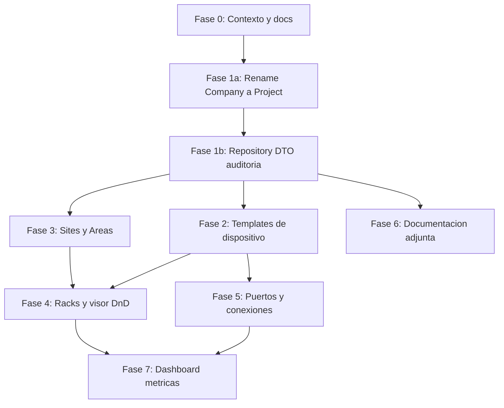

# Roadmap

Hoja de ruta desde el estado actual hacia la visión de [PRODUCT-VISION.md](PRODUCT-VISION.md).

La **Fase 0** (contexto permanente: `.cursor/rules/`, `docs/`, `AGENTS.md`) es el punto de partida y se considera entregada con este documento.

ADR [0001](adr/0001-project-como-scope-raiz.md) **aceptado** (opción A). Scope canónico: `projects` / `project_id` / `X-Project-Id`.

---

## Dependencias

---

## Fase 0 — Contexto permanente

**Estado:** entregada.

- Reglas Cursor en `.cursor/rules/`
- Documentación en `docs/`
- ADR 0001 aceptado; ADR 0002 propuesto
- `AGENTS.md` en la raíz

---

## Fase 1a — Company es el Proyecto

**Estado:** en implementación / entregada con migración `0026`.

- Rename DB/código/UX: `companies` → `projects`, header `X-Project-Id`, UI "Proyecto".

---

## Fase 1b — Fundaciones (Repository / auditoría)

**Estado:** entregada (pilotos `devices` + `connections`/topology).

Entregables:

- ADR 0002 aceptado; carpetas `repositories/` + `dtos/` y aliases `#repositories/*`, `#dtos/*`.
- Piloto devices: `DeviceRepository` + DTOs; soft delete/auditoría (`0027_`).
- Piloto connections/topology: `ConnectionRepository` + DTOs; soft delete/auditoría (`0028_`); canvas layout sin Lucid en controller.
- Resto de módulos: migrar al tocarlos.

---

## Fase 2 — Templates de dispositivo

**Estado:** entregada (migración `0029_`; catálogo global en `0034_` / ADR 0004).

- Tablas `device_templates` y `device_template_ports` (marca, modelo, U, imagen, consumo, peso, vistas, campos custom).
- Catálogo **global** (sin `project_id`): reutilizable en todos los proyectos.
- `devices` instancia un template (`device_template_id`); manufacturer/model denormalizados.
- UI: Settings → Templates; alta de equipo elige template; solo campos de instancia editables.
- Backfill inicial (`0029_`): agrupar por project + type + manufacturer + model; luego unificados como globales.

---

## Fase 3 — Sites y Areas

**Estado:** entregada (migración `0030_`).

- Tablas `sites` y `areas` bajo el proyecto (áreas bajo sitio).
- `devices.site_id` / `devices.area_id` nullable; `location` texto legacy conservado.
- Backfill: sitio "Sin clasificar" + áreas desde ubicaciones de texto distintas.
- UI: Settings → Sitios y áreas; DeviceCreate con select sitio → área.
- Distinto de `work_areas` del canvas (solo visual).

---

## Fase 4 — Racks y visor

**Estado:** entregada (migración `0031_`).

- Tabla `racks` (`project_id` + `area_id`, `height_u`, code, marca/modelo); soft delete.
- Placement en `devices`: `rack_id`, `rack_unit_start`, `rack_face` (front/rear); sin solapes (service).
- API `/racks` + `GET /racks/:id/occupancy`.
- UI `/racks` con visor U: click-to-assign + drag-and-drop nativo (montaje y reubicación).
- DeviceCreate: sitio → área → rack → U/cara; montaje sincroniza site/area.

---

## Fase 5 — Puertos y conexiones enriquecidos ✅

- `port_types` enriquecidos: `default_speed`, `color`, `icon`, `direction`.
- Catálogo `cable_types` + FK nullable `connections.cable_type_id` (enums de medio se mantienen).
- Un puerto = una conexión **física** activa (`deleted_at IS NULL`): service 409 + índices únicos parciales.
- UI: PortTypes / CableTypes en Settings; ConnectionModal con catálogo de cable.

---

## Fase 6 — Documentación adjunta ✅

- Tabla polimórfica `attachments` (file/pdf/plan/photo/diagram/link/note) + soft delete.
- Tabla `secrets` cifrados (AES-GCM vía `crypto_service`); reveal solo roles mutate.
- Storage local de archivos: `backend/storage/attachments/` (ADR 0003).
- UI: `ObjectDocsPanel` (tabs Adjuntos / Secretos) en DeviceDetail, Sites y Racks.

---

## Fase 7 — Dashboard de métricas reales ✅

- `GET /api/dashboard`: contadores agregados en service/repository (sin lógica pesada en React).
- Equipos, racks, sitios/áreas, puertos libres/ocupados, conexiones, VLANs, redes, adjuntos/secretos.
- Ocupación de racks (front+rear), equipos sin documentar / sin enlace físico, alertas derivadas.
- UI Dashboard consumiendo un solo endpoint.

---

## Más allá (no fechado)

### Topología física por rack

- **Fase 1:** racks como contenedores en el diagrama físico; equipos apilados por U con puertos visibles; conexiones puerto↔puerto; highlight al clic en puerto.
- **Fase 2:** asistente **Imprimir reporte** con filtros Sitio → Área → Rack(s) → Cara → equipos sin rack; contenido diagrama / tabla / ambos; PDF client-side (`exportPdf` `table` | `diagram` | `full`).

### Futuro

Monitoreo, SNMP/LLDP/CDP, importación desde switches, escaneo, mapa de planta, Zabbix / PRTG / LibreNMS. La arquitectura de fases 1–7 debe permitir estos módulos sin reescritura.
